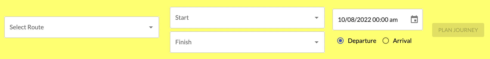
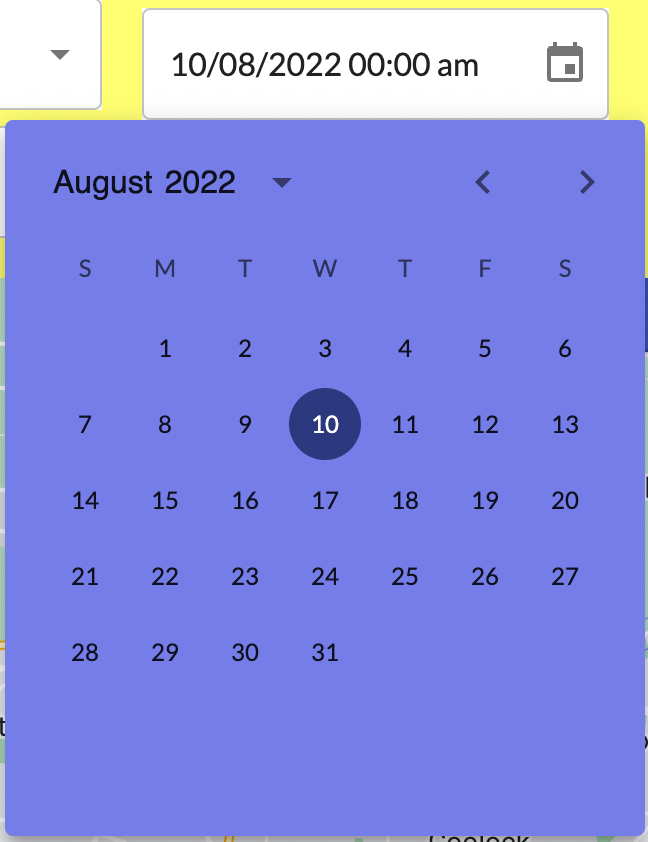
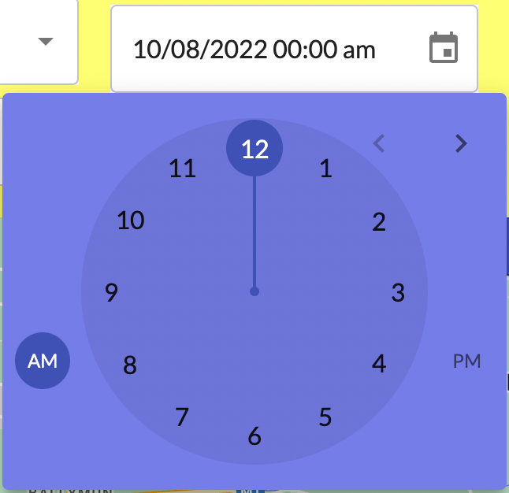
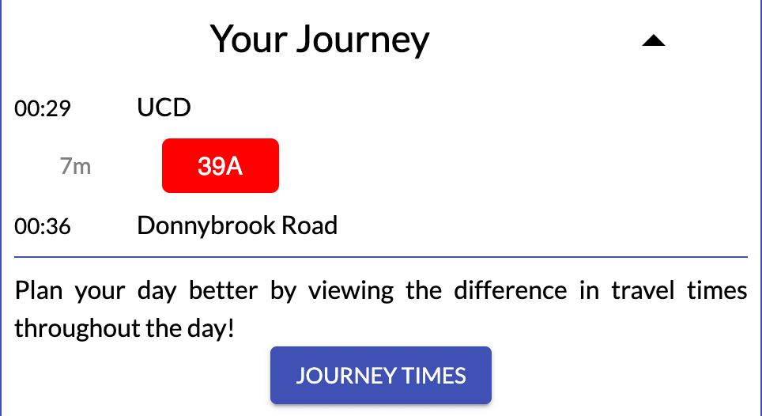
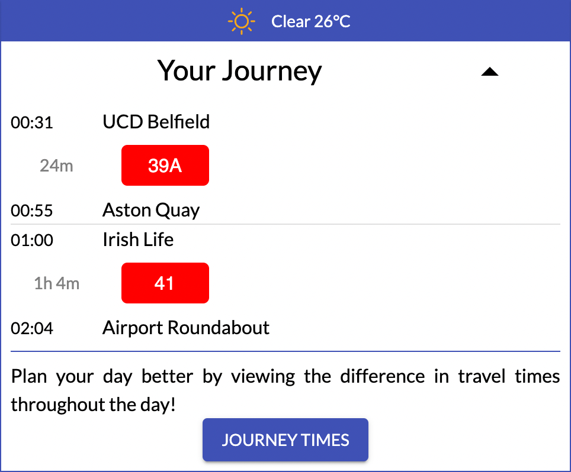
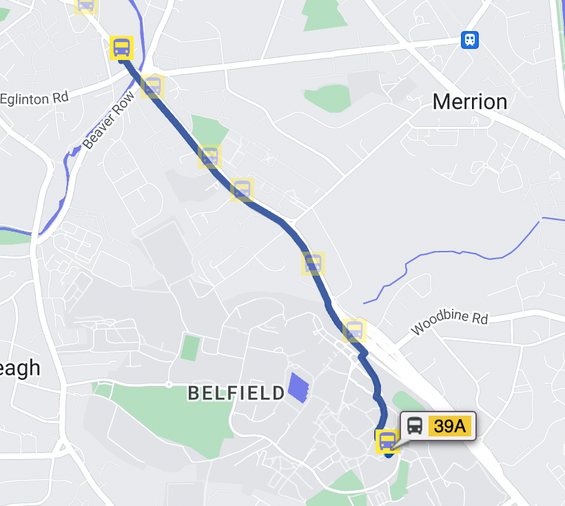
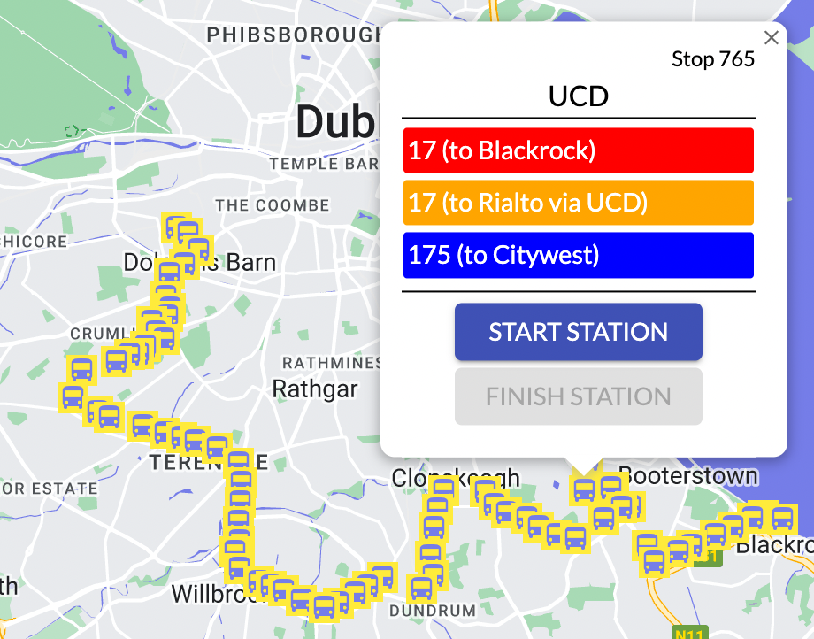

# **BusMe! - A Dublin Bus Journey Planner**

## **What is BusMe?**
---
BusMe is a Dublin Bus journey planner. It is a web application that predicts bus journey times in Dublin City using machine learning models. 

## **How do I use BusMe?**
---
BusMe may be accessed by either clicking [this link](http://ipa-002.ucd.ie/ "BusMe link") or pasting the following link directly into your favourite web browser: [http://ipa-002.ucd.ie/](http://ipa-002.ucd.ie/ "row link")  

BusMe allows any user to provide details of their desired journey and receive a journey plan. The application supports several types of user input and journey types. A step-by-step guide on how interact with BusMe is set out in detail below.

If you are a developer and would like some technical details about the application, or would like to make a code contribution, please see the developer readme, which can be found at [this link.](https://github.com/jvm-comp47360/bus-me/blob/main/developer_info/ReadMe_Developer.md "Developer Readme")    

### **1. Route Mode Selection**  
<!--    -->

 

  

There is a "Route Mode" selection button on the top navigation bar. By default, this is set to "Single Route", which means that you will need to provide the route which you wish to travel on. If you do not know what route you need to travel on, then we would recommend setting the application to "Multi Route" mode, which will automatically predict the best route for your journey, including any stopovers if necessary.    

### **2. Control Panel**  
<!--  -->

 

 
Directly below the navigation bar is a control panel for main data input. There are three core parts in this panel.  

- **Dropdowns**  
 In "Single Route" mode, there are three dropdowns - the first allows you to select the route, then the other two allow you to choose the start and finish stops within the route. In "Multi Route" mode, the route dropdown disappears and the stops can be chosen freely.   
<!--   -->

 

 

*Please note that all these selections can be searched by typing directly into in the dropdowns.*

- **Time Selection**   
The calendar icon can be clicked to select the date and time of the journey. The departure and arrival radio toggles can also be clicked depending on whether you would like your journey to start or end at the provided date. 

There are two steps to the date time selection process. First, a calendar appears, allowing you to select the date. Then, a clock appears to select an accurate time.
<!--   -->

 

   

- **Plan Journey**  
Once the above information has been provided, the "Plan Journey" button will activate and become clickable. Clicking it will retrieve route planning and time predictions.  

### **3. Results**  
There are two core components to the way the prediction result will be displayed. The first is a journey panel that will display the journey plan in text. The second is the map view of the prediction result. 
- **Journey Panel**  
Journey panel will show on the right top of the map. It has a time table with the start stop, finish stop, line id of the routes and the prediction result. A Journey times button will show a line chart with recent hours prediction results. Please note that in the event that "Multi Route" mode is selected, the journey panel will show every leg of the journey, including stopovers, if applicable.

 

 

   

- **Map View**  
The map shows the prediction route on the map.  

 

   

### **4. Additional Functions**  
Apart from the fundamental functions for prediction, some supply functions are also offered here which are geolocation, weather forecast and stops on the map.   
- **Geolocation**  
A geolocation bar is on the left top of the map which consists of a search bar and a target icon. Users can click the icon to automatically get the present location. If there are some location issues, users can search and select the location manually which is the same as the dropdown in the control panel.  

 

   

- **Weather Forecast**  
The weather bar will show on the right top of the map before prediction. This shows the current weather in Dublin. Users can take this information into account when planning their bus journey. 

 

    

- **Stops on Map**  
All the stops in Dublin will show on the map. This is not just to show the location of the stops - clicking on a given marker will give the user another way to interact with the application. Once any stop icon on the map is clicked, there will a pop-up show the the stop information which include its name, a list of lines that pass it and two buttons which can choose as a start or finish stop. In addition, in the single route mode, by clicking any line in the list, users can automatically jump to that line.  

 

  

*Icon Credit: https://github.com/alexandresanlim/Badges4-README.md-Profile*

**END**
