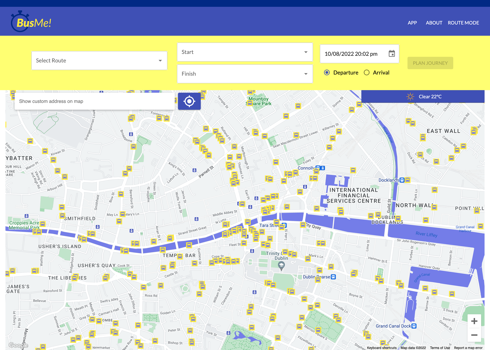
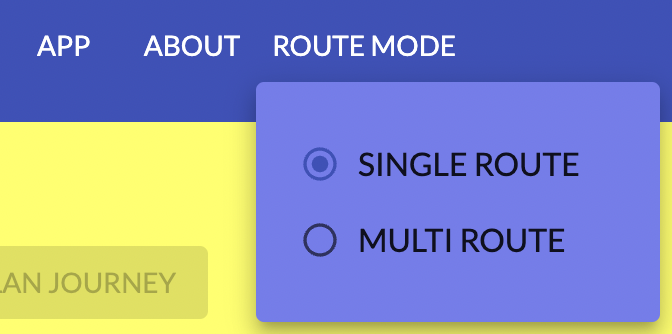
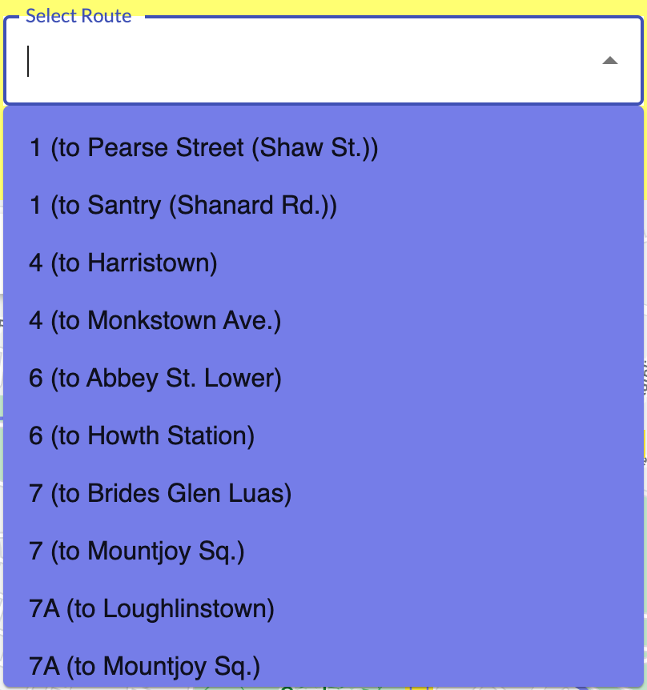
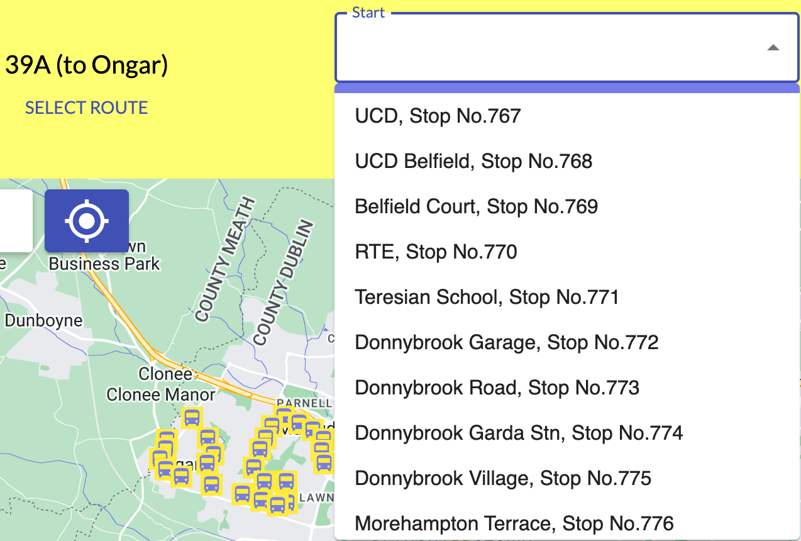
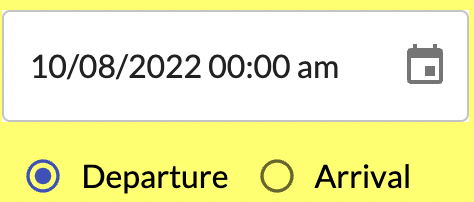
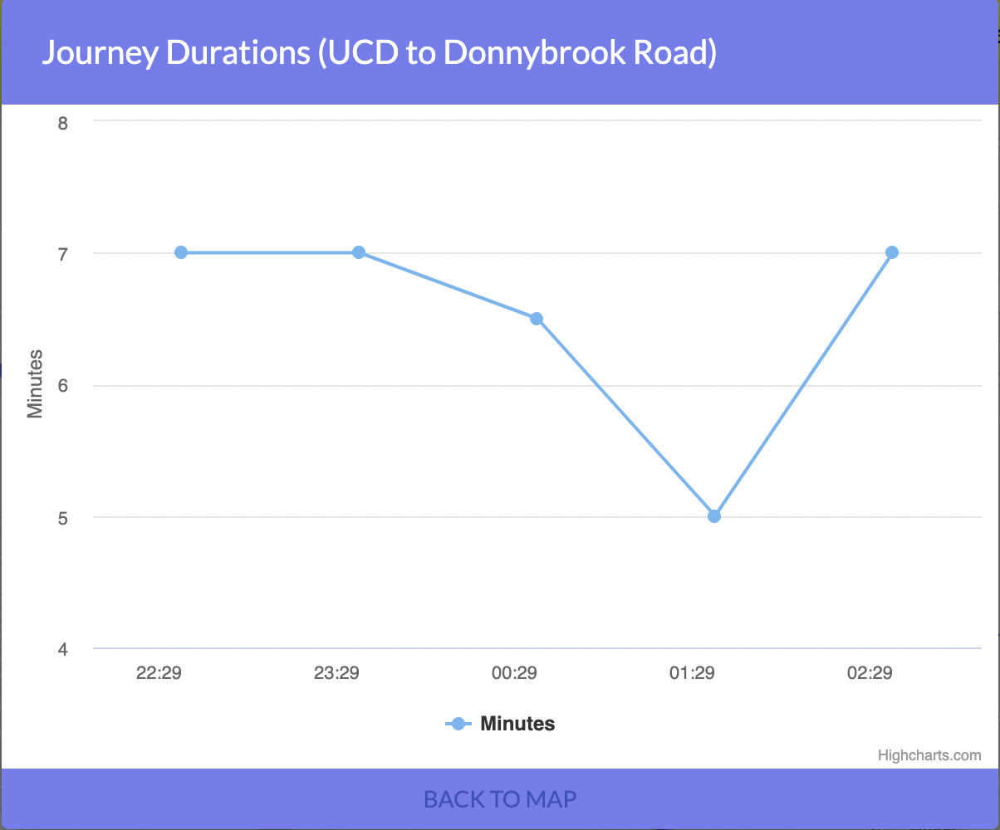
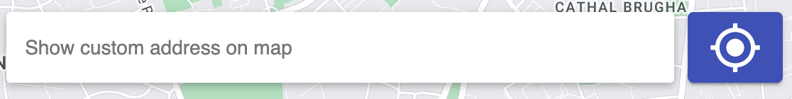

# **BusMe -- A Dublin Bus Journey Planner**

## **What is BusMe?**
---
BusMe is a Dublin Bus Journey Planner. It's a web application that predicts bus journey times in Dublin City. The prediction is driven by machine learning models and doesn't rely on any reality equipment.

## **How do I use BusMe?**
---
Enter this page by click on the paste [BusMe](http://ipa-002.ucd.ie/ "BusMe link") link in a browser.   
Web link: [http://ipa-002.ucd.ie/](http://ipa-002.ucd.ie/ "row link")  

### **1. Route Mode Choose**  
<!--    -->

 

  

There is a ROUTE MODE selection on the top navigation bar. It's default single route, which users first need to select a route. The multi route means user can choose a stop directily.    

### **2. Route Search**  
<!--  -->

 

 
It's a control panel for main data input. There are three parts in this panel.  

- **Dropdown**  
In the single mode, there are three dropdowns. First to select the route, then two of them can choose the start and finish stops within the route. In the multi mode, the stops can choose freely.   
<!--   -->

 

 

*All these selection can be searched by keywords in the dropdowns.*

- **Time Selection**   
Users can click the calendar icon to select the date. It consists of three child selection. Firstly, a calendar to choose the day, month and year. Secondly, a clock to select an accurate time in minutes. Thirdly, the type of time users choose is departure or arrival.
<!--   -->

 

   

- **Plan Journey**  
Once above data as selected, there is a plan journey button. Click it will get route planning and time predictions.  

### **3. Result Shown**  
The prediction result will be shown in two part. One is a journey panel show the text information. The other is the map view of the prediction result. 
- **Journey Panel**  
Journey panel will show on the right top of the map. It has a time table with the start stop, finish stop, line id of the routes and the prediction result.  
A Journey times button will show a line chart with recent hours prediction results.   

 

   

 

   

- **Map View**  
The map shows the prediction route on the map.  

 

   

### **4. Additional Functions**  
Apart from the fundamental functions for prediction, some supply functions are also offered here which are geolocation, weather forecast and stops on the map.   
- **Geolocation**  
A geolocation bar is on the left top of the map which consists of a search bar and a target icon. Users can click the icon to automatically get the present location. If there are some location issues, users can search and select the location manually which is the same as the dropdown in the control panel.  

 

   

- **Weather Forecast**  
The weather bar will show on the right top of the map before prediction. It's current weather of Dublin. Users can take it as a suggestion for bus journey. 

 

    

- **Stop on Map**  
All the stops in Dublin will show on the map. It's not only a simple view of their postion, but some functions are realized with the stop icon. Once click any stop icon on the map, there will a pop-up show the the stop informations which include its name, lists of line that passing it and two buttons which can choose as a start or finish stop. In addition, in the single mode, by the click of any line in the list, users can autmatically jump to that line.  

 

  